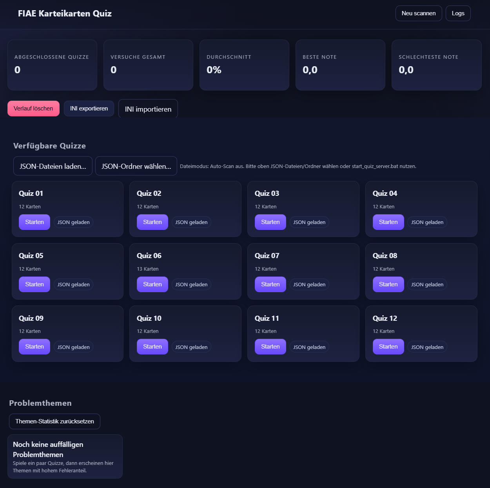

# FIAE-Karteikarten-Quiz


Ein leichtgewichtiges, lokales Lern- und Selbsttest-Tool zur Vorbereitung auf die Abschlussprüfung (AP1/AP2). Ziel ist es, schnell die eigenen Problemthemen zu erkennen und gezielt zu üben – ohne Installation, ohne Backend, direkt im Browser.

- Fragetafeln pro Themenblock (12 Fragen je Quiz)
- Zufällige Antwortreihenfolge (kein „oben links ist immer richtig“)
- Ergebnisanzeige mit Prozent und Note, „Abgeschlossen“-Badge in der Übersicht
- Problemthemen: wertet Fehler über alle Versuche aus und listet nur echte Schwächen
- Fortschritt bleibt lokal erhalten (LocalStorage) und kann als INI exportiert/importiert werden
- Fragen liegen als JSON vor und können leicht ergänzt oder angepasst werden (keine SQL-Aufgaben enthalten)

Repo: `https://github.com/YouNix24/FIAE-Karteikarten-Quiz`


## Schnellstart

### Windows (empfohlen)

1. Repository herunterladen
   - Git: `git clone https://github.com/YouNix24/FIAE-Karteikarten-Quiz.git`
   - Oder als ZIP von GitHub herunterladen und entpacken
2. Ordner öffnen und starten: `start_quiz_server.bat`
   - Der lokale Server startet und öffnet automatisch deinen Standard-Browser
   - Die App ist dann unter `http://localhost:<PORT>/FIAE_Quiz.html` erreichbar

Alternative (ohne Batch): Die Datei `FIAE_Quiz.html` im Browser öffnen und oben per Button die JSON-Dateien bzw. den `JSON/`-Ordner manuell laden.

## Bedienung

- Startseite zeigt alle verfügbaren Quizze (je 12 Karten)
- „Starten“ öffnet den Fragen-Runner
  - Navigation: Zurück/Weiter, Hinweis einblenden, „Fertig“ zum Auswerten
  - Antworten sind pro Frage zufällig angeordnet
- Ergebnis: Korrekte/insgesamt, Prozent, Note, Fortschrittsbalken
- Abgeschlossen-Status: In der Übersicht rechts oben je Karte als Badge sichtbar; bleibt beim nächsten Start erhalten
- Dashboard (oben): Übersicht über abgeschlossene Quizze, Versuche, Durchschnitt/Best/Schlechteste Note
- Problemthemen: Zeigt nur Themen mit mindestens einem Fehler, sortiert nach Fehlerzahl/Quote
- Verlauf/Statistik
  - „Verlauf löschen“ setzt alle Versuche/Statistiken zurück
  - Export/Import als INI über die Buttons


## Problemthemen – wie es funktioniert

Das Tool fasst deine Antworten je Themengebiet zusammen (Versuche über die Zeit) und zeigt nur Themen mit echten Fehlern an. Die Zuordnung erfolgt automatisch anhand der Frageformulierung oder – wenn vorhanden – über Felder `topic` bzw. `tags` in der Frage. Unterstützte Themen (Auszug):

- Netzwerke
- Projektmanagement (inkl. Scrum/Kanban)
- IT-Sicherheit
- Web & HTTP
- Cloud & Virtualisierung
- Speicher & RAID
- Qualität & Tests
- Betriebssysteme & Tools
- Recht & BWL
- Softwareentwurf & UML
- Allgemeine IT-Grundlagen (nur wenn keine andere Zuordnung passt)

Tipp: Setze optional `topic` (String) oder `tags` (String/Array) in den JSON-Fragen, um die Zuordnung explizit zu steuern.


## Inhalte anpassen (JSON)

Alle Fragen liegen im Ordner `JSON/` als `QuizNN.json`. Jede Datei enthält ein Array `cards` mit Objekten dieses Schemas:

```
{
  "cards": [
    {
      "question": "Deine Frage als vollständiger Satz?",
      "choices": ["Antwort A", "Antwort B", "Antwort C", "Antwort D"],
      "correct_index": 0,
      "hint": "Kurzer Hinweis zum Verstehen",
      "topic": "(optional) Kategorie",
      "tags": ["(optional)", "Stichworte"]
    }
  ]
}
```

Richtlinien:
- 12 Fragen je Quizdatei (einheitlich für die App)
- Keine SQL-Aufgaben (fallen in AP1 weg)
- Keine doppelten Fragen über verschiedene Quizze hinweg
- Aussagekräftige, nicht abgekürzte Formulierungen (z. B. statt „OCP heißt…?“: vollständige Beschreibung/Frage)

Nach Änderungen einfach die Seite neu laden.


## Projektstruktur

- `FIAE_Quiz.html` – Startseite/Anwendung
- `JS/app.js` – Logik (Laden der JSON, Runner, Auswertung, Problemthemen, Persistenz)
- `CSS/style.css` – Layout und Styles
- `JSON/QuizNN.json` – Fragenkataloge
- `start_quiz_server.bat` – Startet lokalen Server auf Windows (öffnet Standard-Browser)
- `server.ps1` – Simpler PowerShell-Server mit Logging in `Logs/`


## Häufige Fragen (FAQ)

- „Ich sehe die JSONs nicht im file:// Modus“
  - Im Dateimodus ist das automatische Scannen aus Sicherheitsgründen aus. Nutze die Buttons oben, um JSON-Dateien/Ordner zu laden, oder starte den lokalen Server.
- „Die Änderungen werden nicht angezeigt“
  - Mit Strg+F5 hart neu laden (Browsercache umgehen). Bei Serverstart über Batch wird dein Standard-Browser genutzt.
- „Wo werden meine Ergebnisse gespeichert?“
  - Lokal im Browser (LocalStorage). Export/Import über INI ist möglich.


## Download & Installation (GitHub)

- Repo: `https://github.com/YouNix24/FIAE-Karteikarten-Quiz`
- Clone:
  - `git clone https://github.com/YouNix24/FIAE-Karteikarten-Quiz.git`
  - `cd FIAE-Karteikarten-Quiz`
  - Windows: `start_quiz_server.bat`
  - macOS/Linux: `python3 -m http.server 8000` und dann `http://localhost:8000/FIAE_Quiz.html`
- ZIP: Über GitHub „Code → Download ZIP“, entpacken und wie oben starten


## Hinweise

- Das Tool arbeitet vollständig lokal. Es sendet keine Daten nach außen. Der mitgelieferte PowerShell-Server schreibt reine Text-Logs in `Logs/` für das lokale Debugging.
- Wenn du das mitgelieferte PDF „Zusammenfassung_Abschlussprüfung – Fast alle Themen.pdf“ ersetzen willst, lege die neue Datei einfach neben die HTML ab und passe ggf. den Link in der Topbar an.

Viel Erfolg beim Lernen – und viel Spaß beim gezielten Schließen deiner Wissenslücken!
## Themen (Quiz01–11)

Kurzüberblick der Themen je Quiz:

- Quiz01: Betriebssysteme, DHCP
- Quiz02: OSI-Modell
- Quiz03: IT-Sicherheit
- Quiz04: Netzwerktopologien
- Quiz05: IP-Adressierung, Speicher & RAID, Stakeholder
- Quiz06: Anforderungsmanagement, ERP, Organisation & Führung, Qualität & Prozesse, SLA & Betrieb
- Quiz07: Netzwerkgeräte, Versionierung
- Quiz08: DDR-RAM, Netzwerkgeräte
- Quiz09: Vorgehensmodelle
- Quiz10: Logikgatter, UEFI/BIOS, USV-Berechnung
- Quiz11: Programmlogik

Gesamtliste aller Themen aus Quiz01–11 (einmalig, alphabetisch):

- Anforderungsmanagement
- Betriebssysteme
- DDR-RAM
- DHCP
- ERP
- IP-Adressierung
- IT-Sicherheit
- Logikgatter
- Netzwerkgeräte
- Netzwerktopologien
- Organisation & Führung
- OSI-Modell
- Programmlogik
- Qualität & Prozesse
- SLA & Betrieb
- Speicher & RAID
- Stakeholder
- UEFI/BIOS
- USV-Berechnung
- Versionierung
- Vorgehensmodelle